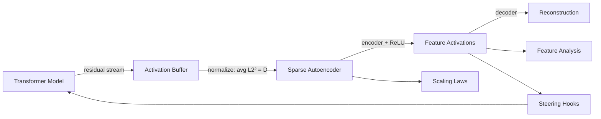

# Scaling Monosemanticity — Mechanistic Interpretability

[](https://arxiv.org/abs/2605.29358)
[](LICENSE)

A faithful open-source reproduction of [**Scaling Monosemanticity: Extracting Interpretable Features from Claude 3 Sonnet**](https://arxiv.org/abs/2605.29358) (Anthropic, 2024) by Templeton et al.

This repository implements the full sparse autoencoder (SAE) pipeline described in the paper — activation collection, dictionary learning, scaling laws, feature interpretability analysis, and causal steering — adapted for **open transformer models** via [TransformerLens](https://github.com/TransformerLensOrg/TransformerLens).

> **Note:** Claude 3 Sonnet is proprietary and not publicly available. This implementation uses **GPT-2** (and any TransformerLens-compatible model) as a drop-in substitute, preserving the paper's methodology, loss function, and analysis tools.

---

## 🖥️ Web Dashboard

This repository includes an **interactive web dashboard** for exploring SAE features, scaling laws, and causal steering — all in the browser.

### Launch

```bash
pip install flask>=3.0
python app.py
# Open http://localhost:5000
```

The dashboard works **out of the box** with built-in demo data. To use your own trained SAE:

```bash
python app.py --sae checkpoints/sae/sae_final.pt --model gpt2
```

### Dashboard Features

| Section | Description |
|---------|-------------|
| **Architecture** | Animated pipeline diagram with the SAE loss equation |
| **Feature Explorer** | Browse features, view top-activating examples with highlighted tokens |
| **Scaling Laws** | Interactive Chart.js plots — loss, variance explained, and L0 vs compute |
| **Steering Playground** | Configure prompt, feature, and coefficient — see baseline vs steered output |
| **Training Monitor** | Loss curves, variance explained, dead feature gauge |
| **Paper Reference** | Paper ↔ code mapping table, key metrics, citation |

## What This Paper Shows

The superposition hypothesis predicts that neural networks encode far more concepts than they have neurons by representing features as **nearly-orthogonal directions** in activation space. Sparse autoencoders perform **dictionary learning** on these activations to recover monosemantic features.

Anthropic's key findings:

| Finding | Description |
|---------|-------------|
| **Scalability** | SAEs extract interpretable features from production-scale models, not just toy transformers |
| **Scaling laws** | Loss decreases as a power law with compute; optimal feature count and training steps also follow power laws |
| **Abstract features** | Features are multilingual, multimodal, and capture both concrete and abstract concepts |
| **Causal steering** | Amplifying or suppressing a feature direction changes model behavior in interpretable ways |
| **Safety-relevant features** | Features for deception, bias, sycophancy, and dangerous content can be identified |

---

## Architecture



### SAE Loss (Section 1.1)

The autoencoder minimizes:

```
L = ||x - x̂||² + λ · Σᵢ fᵢ(x) · ||W_dec[:,i]||₂
```

where `fᵢ(x) = ReLU(W_enc[i] · x + b_enc[i])` and activations are pre-normalized so their average squared L2 norm equals the residual stream dimension `D`.

---

## Quick Start

### 1. Install

```bash
git clone git@github.com:Shahip2016/Scaling-Monosemanticity-mech-interp-.git
cd Scaling-Monosemanticity-mech-interp-
pip install -r requirements.txt
pip install -e .
```

**Requirements:** Python 3.10+, PyTorch 2.0+, ~8 GB RAM (CPU) or a GPU with 8+ GB VRAM for training.

### 2. Collect Activations

Extract normalized residual stream activations from the **middle layer** (paper Section 1.2):

```bash
python scripts/collect_activations.py \
    --model gpt2 \
    --max-tokens 500000 \
    --output data/activations.pt
```

### 3. Train SAE

Train a sparse autoencoder with the paper's L1 coefficient (λ = 5):

```bash
python scripts/train_sae.py \
    --activations data/activations.pt \
    --n-features 16384 \
    --l1 5.0 \
    --steps 10000 \
    --output-dir checkpoints/sae
```

**Feature size presets** (scaled from the paper's 1M / 4M / 34M):

| Preset | Features | Paper equivalent |
|--------|----------|------------------|
| `small` | 4,096 | ~1M |
| `medium` | 16,384 | ~4M |
| `large` | 65,536 | ~34M |

### 4. Analyze Features

Export top-activating examples and search for concept-specific features:

```bash
# Analyze specific feature indices
python scripts/analyze_features.py \
    --sae checkpoints/sae/sae_final.pt \
    --features 0 1 2 3 \
    --output-dir results/features

# Search by keyword (e.g. "bridge", "neuroscience")
python scripts/analyze_features.py \
    --sae checkpoints/sae/sae_final.pt \
    --keyword "Golden Gate Bridge"
```

### 5. Steer Model Behavior

Causally intervene by adding a feature direction to the residual stream:

```bash
python scripts/steer_feature.py \
    --sae checkpoints/sae/sae_final.pt \
    --feature 42 \
    --prompt "The famous bridge in San Francisco is the" \
    --coefficients -30 30
```

---

## Scaling Laws (Section 1.3)

The paper shows that SAE training loss follows a **power law** with respect to compute, and that the optimal allocation of FLOPs between feature count and training steps also follows power laws.

Run a hyperparameter sweep and generate scaling law plots:

```bash
python scripts/run_scaling_laws.py \
    --activations data/activations.pt \
    --features 4096 16384 65536 \
    --steps 1000 2500 5000 \
    --output-dir results/scaling_laws
```

Outputs:
- `sweep_results.json` — loss, L0, and variance explained for each (features, steps) pair
- `allocation.json` — compute-optimal hyperparameters and power-law fits
- `scaling_laws.png` — loss vs compute, optimal features vs compute, optimal steps vs compute

---

## Project Structure

```
├── app.py                     # Flask dashboard server
├── frontend/
│   ├── index.html             # Single-page dashboard
│   ├── styles.css             # Design system (dark theme)
│   ├── app.js                 # Interactive logic
│   └── demo_data.js           # Demo data for offline use
├── src/scaling_monosemanticity/
│   ├── sae.py                 # SAE architecture & loss (Section 1.1)
│   ├── activation_buffer.py   # Residual stream collection & normalization
│   ├── train.py               # Training loop with dead-feature tracking
│   ├── scaling_laws.py        # Compute sweeps & power-law fitting (Section 1.3)
│   ├── analysis.py            # Feature interpretability tools (Section 2)
│   └── steering.py            # Causal interventions (Section 2.1)
├── scripts/
│   ├── collect_activations.py
│   ├── train_sae.py
│   ├── run_scaling_laws.py
│   ├── analyze_features.py
│   └── steer_feature.py
├── config/default.yaml
├── tests/test_sae.py
└── requirements.txt
```

---

## Paper ↔ Implementation Mapping

| Paper Section | This Repo | Module |
|---------------|-----------|--------|
| 1.1 Sparse Autoencoders | ReLU encoder, linear decoder, scaled L1 loss | `sae.py` |
| 1.2 SAE Experiments | Middle-layer residual stream, λ=5, dead features | `train.py`, `activation_buffer.py` |
| 1.3 Scaling Laws | Grid sweep, power-law fits, compute-optimal allocation | `scaling_laws.py` |
| 2.1 Feature Interpretability | Top-activating examples, keyword search, rubric scoring | `analysis.py` |
| 2.1 Influence on Behavior | Residual stream steering hooks | `steering.py` |

---

## Key Metrics (from the paper)

After training, evaluate your SAE against these paper benchmarks:

| Metric | Paper target | How to check |
|--------|-------------|--------------|
| **L0** (active features per token) | < 300 | Printed during training |
| **Variance explained** | ≥ 65% | `train_summary.json` |
| **Dead features** | 2% (1M), 35% (4M), 65% (34M) | `train_summary.json` |

---

## Using Other Models

Any model supported by TransformerLens works out of the box:

```bash
# GPT-2 Medium (larger, more features needed)
python scripts/collect_activations.py --model gpt2-medium --layer 12

# Pythia-410M
python scripts/collect_activations.py --model pythia-410m --layer 12
```

For models closer to Claude 3 Sonnet in scale, use the `large` feature preset (65K+) and increase `--max-tokens` and `--steps`.

---

## Running Tests

```bash
python tests/test_sae.py
# or
pytest tests/
```

---

## Limitations

This reproduction faithfully implements the paper's **methodology** but differs in scope:

1. **Model access** — Claude 3 Sonnet is proprietary; we use GPT-2 and other open models.
2. **Feature scale** — The paper trained up to 34M features; consumer hardware limits us to ~65K by default.
3. **Automated interpretability** — The paper uses Claude 3 Opus for rubric scoring; this repo provides the rubric framework and keyword-based search as alternatives.
4. **Multimodal features** — Image activation analysis requires a multimodal model (not included by default).

---

## Citation

If you use this code, please cite the original paper:

```bibtex
@article{templeton2024scaling,
  title={Scaling Monosemanticity: Extracting Interpretable Features from Claude 3 Sonnet},
  author={Templeton, Adly and Conerly, Tom and Marcus, Jonathan and Lindsey, Jack
          and Bricken, Trenton and Chen, Brian and Pearce, Adam and Citro, Craig
          and Ameisen, Emmanuel and Jones, Andy and Cunningham, Hoagy and Turner, Nicholas L
          and McDougall, Callum and MacDiarmid, Monte and Tamkin, Alex and Durmus, Esin
          and Hume, Tristan and Mosconi, Francesco and Freeman, C. Daniel and Sumers, Theodore R
          and Rees, Edward and Batson, Joshua and Jermyn, Adam and Carter, Shan
          and Olah, Chris and Henighan, Tom},
  journal={arXiv preprint arXiv:2605.29358},
  year={2024}
}
```

**Related work:**
- [Towards Monosemanticity](https://transformer-circuits.pub/2023/monosemantic-features) — Bricken et al., 2023
- [Toy Models of Superposition](https://transformer-circuits.pub/2022/toy_model/) — Elhage et al., 2022

---

## License

MIT License. See [LICENSE](LICENSE) for details.
